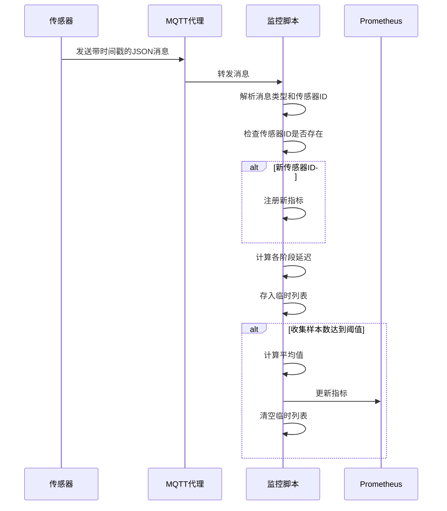
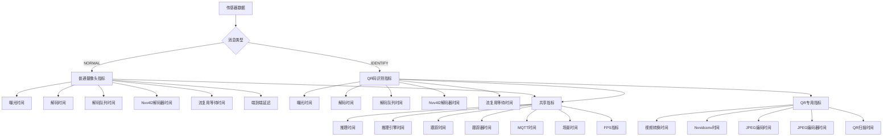

```mermaid
sequenceDiagram
    participant 传感器
    participant MQTT代理
    participant 监控脚本
    participant Prometheus
  
    传感器->>MQTT代理: 发送带时间戳的JSON消息
    MQTT代理->>监控脚本: 转发消息
    监控脚本->>监控脚本: 解析消息类型和传感器ID
    监控脚本->>监控脚本: 检查传感器ID是否存在
  
    alt 新传感器ID
        监控脚本->>监控脚本: 注册新指标
    end
  
    监控脚本->>监控脚本: 计算各阶段延迟
    监控脚本->>监控脚本: 存入临时列表
  
    alt 收集样本数达到阈值
        监控脚本->>监控脚本: 计算平均值
        监控脚本->>Prometheus: 更新指标
        监控脚本->>监控脚本: 清空临时列表
    end
```

```mermaid
graph TD
    A[传感器数据] --> B{消息类型}
  
    B -->|NORMAL| C[普通摄像头指标]
    B -->|IDENTIFY| D[QR码识别指标]
  
    C --> C1[曝光时间]
    C --> C2[解码时间]
    C --> C3[解码队列时间]
    C --> C4[Nvv4l2解码器时间]
    C --> C5[流复用等待时间]
    C --> C6[端到端延迟]
  
    D --> D1[曝光时间]
    D --> D2[解码时间]
    D --> D3[解码队列时间]
    D --> D4[Nvv4l2解码器时间]
    D --> D5[流复用等待时间]
  
    C --> E[共享指标]
    D --> E
  
    E --> E1[推理时间]
    E --> E2[推理引擎时间]
    E --> E3[跟踪时间]
    E --> E4[跟踪器时间]
    E --> E5[MQTT时间]
    E --> E6[场景时间]
    E --> E7[FPS指标]
  
    D --> F[QR专用指标]
    F --> F1[视频转换时间]
    F --> F2[Nvvidconv时间]
    F --> F3[JPEG编码时间]
    F --> F4[JPEG编码器时间]
    F --> F5[QR扫描时间]
```
