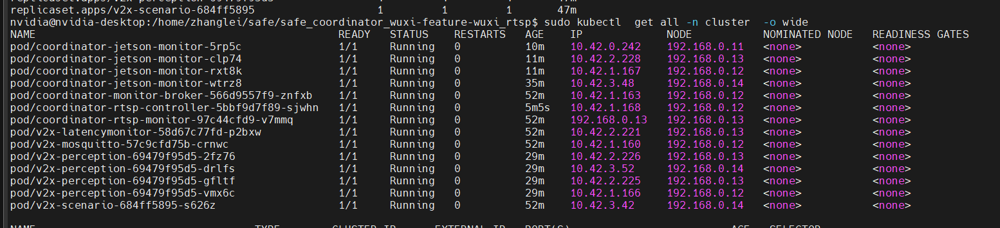
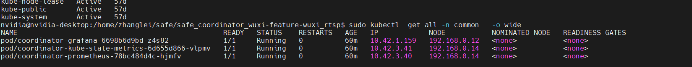
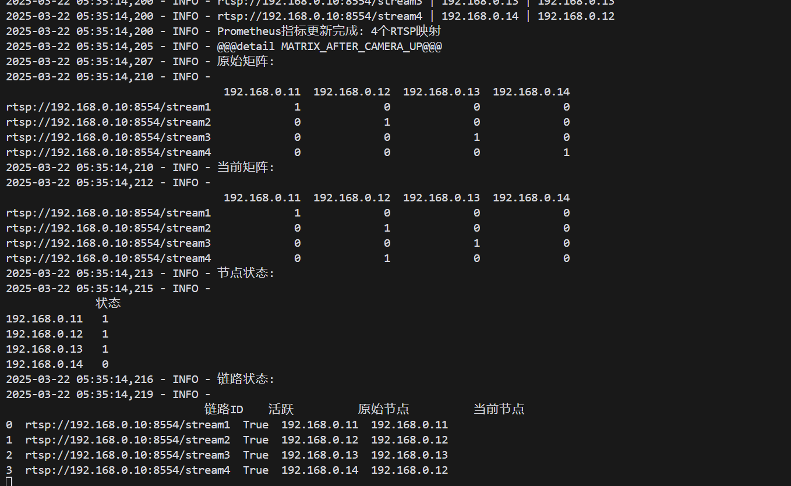

12 11    13   都不可reboot

14上有一个 pod/v2x-scenario-684ff5895-s626z



嗯   14   也不能reboot    看起来

算了   不管了

我现reboot一下 14吧

下个星期来看能不能那啥  让一个node干干净净的  再去关机拔网线试试看



为啥关机拿到的结果还行啊   奇了怪了

哦   不是  关机之后     会一会说我好了  一会说我不好

2
2025-03-22 05:38:49,694 - INFO - @@@detail NODE_STATUS_CHANGE@@@ 节点 192.168.0.14 状态从 0 变为 1

2025-03-22 05:40:04,885 - INFO - @@@detail NODE_STATUS_CHANGE@@@ 节点 192.168.0.14 状态从 0 变为 1
2025-03-22 05:40:05,187 - INFO - @@@detail NODE_STATUS_CHANGE@@@ 节点 192.168.0.14 状态从 1 变为 0
2025-03-22 05:40:05,889 - INFO - @@@detail NODE_STATUS_CHANGE@@@ 节点 192.168.0.14 状态从 0 变为 1
2025-03-22 05:40:06,269 - INFO - @@@detail NODE_STATUS_CHANGE@@@ 节点 192.168.0.14 状态从 1 变为 0
2025-03-22 05:40:06,891 - INFO - @@@detail NODE_STATUS_CHANGE@@@ 节点 192.168.0.14 状态从 0 变为 1
2025-03-22 05:40:07,357 - INFO - @@@detail NODE_STATUS_CHANGE@@@ 节点 192.168.0.14 状态从 1 变为 0
2025-03-22 05:40:07,895 - INFO - @@@detail NODE_STATUS_CHANGE@@@ 节点 192.168.0.14 状态从 0 变为 1
2025-03-22 05:40:08,435 - INFO - @@@detail NODE_STATUS_CHANGE@@@ 节点 192.168.0.14 状态从 1 变为 0
2025-03-22 05:40:08,895 - INFO - @@@detail NODE_STATUS_CHANGE@@@ 节点 192.168.0.14 状态从 0 变为 1
2025-03-22 05:40:09,509 - INFO - @@@detail NODE_STATUS_CHANGE@@@ 节点 192.168.0.14 状态从 1 变为 0
2025-03-22 05:40:09,898 - INFO - @@@detail NODE_STATUS_CHANGE@@@ 节点 192.168.0.14 状态从 0 变为 1
2025-03-22 05:40:10,581 - INFO - @@@detail NODE_STATUS_CHANGE@@@ 节点 192.168.0.14 状态从 1 变为 0
2025-03-22 05:40:10,900 - INFO - @@@detail NODE_STATUS_CHANGE@@@ 节点 192.168.0.14 状态从 0 变为 1
2025-03-22 05:40:11,651 - INFO - @@@detail NODE_STATUS_CHANGE@@@ 节点 192.168.0.14 状态从 1 变为 0
2025-03-22 05:40:11,902 - INFO - @@@detail NODE_STATUS_CHANGE@@@ 节点 192.168.0.14 状态从 0 变为 1
2025-03-22 05:40:12,721 - INFO - @@@detail NODE_STATUS_CHANGE@@@ 节点 192.168.0.14 状态从 1 变为 0
2025-03-22 05:40:12,902 - INFO - @@@detail NODE_STATUS_CHANGE@@@ 节点 192.168.0.14 状态从 0 变为 1
2025-03-22 05:40:13,793 - INFO - @@@detail NODE_STATUS_CHANGE@@@ 节点 192.168.0.14 状态从 1 变为 0
2025-03-22 05:40:13,901 - INFO - @@@detail NODE_STATUS_CHANGE@@@ 节点 192.168.0.14 状态从 0 变为 1
2025-03-22 05:40:14,881 - INFO - @@@detail NODE_STATUS_CHANGE@@@ 节点 192.168.0.14 状态从 1 变为 0
2025-03-22 05:40:14,904 - INFO - @@@detail NODE_STATUS_CHANGE@@@ 节点 192.168.0.14 状态从 0 变为 1
2025-03-22 05:40:15,991 - INFO - @@@detail NODE_STATUS_CHANGE@@@ 节点 192.168.0.14 状态从 1 变为 0
2025-03-22 05:40:16,917 - INFO - @@@detail NODE_STATUS_CHANGE@@@ 节点 192.168.0.14 状态从 0 变为 1
2025-03-22 05:40:17,069 - INFO - @@@detail NODE_STATUS_CHANGE@@@ 节点 192.168.0.14 状态从 1 变为 0
2025-03-22 05:40:17,919 - INFO - @@@detail NODE_STATUS_CHANGE@@@ 节点 192.168.0.14 状态从 0 变为 1
2025-03-22 05:40:18,141 - INFO - @@@detail NODE_STATUS_CHANGE@@@ 节点 192.168.0.14 状态从 1 变为 0
2025-03-22 05:40:18,921 - INFO - @@@detail NODE_STATUS_CHANGE@@@ 节点 192.168.0.14 状态从 0 变为 1
2025-03-22 05:40:19,210 - INFO - @@@detail NODE_STATUS_CHANGE@@@ 节点 192.168.0.14 状态从 1 变为 0
2025-03-22 05:40:19,923 - INFO - @@@detail NODE_STATUS_CHANGE@@@ 节点 192.168.0.14 状态从 0 变为 1
2025-03-22 05:40:20,293 - INFO - @@@detail NODE_STATUS_CHANGE@@@ 节点 192.168.0.14 状态从 1 变为 0
2025-03-22 05:40:20,925 - INFO - @@@detail NODE_STATUS_CHANGE@@@ 节点 192.168.0.14 状态从 0 变为 1
2025-03-22 05:40:21,370 - INFO - @@@detail NODE_STATUS_CHANGE@@@ 节点 192.168.0.14 状态从 1 变为 0
2025-03-22 05:40:21,926 - INFO - @@@detail NODE_STATUS_CHANGE@@@ 节点 192.168.0.14 状态从 0 变为 1
2025-03-22 05:40:22,442 - INFO - @@@detail NODE_STATUS_CHANGE@@@ 节点 192.168.0.14 状态从 1 变为 0
2025-03-22 05:40:22,927 - INFO - @@@detail NODE_STATUS_CHANGE@@@ 节点 192.168.0.14 状态从 0 变为 1
2025-03-22 05:40:23,510 - INFO - @@@detail NODE_STATUS_CHANGE@@@ 节点 192.168.0.14 状态从 1 变为 0
2025-03-22 05:40:23,931 - INFO - @@@detail NODE_STATUS_CHANGE@@@ 节点 192.168.0.14 状态从 0 变为 1
2025-03-22 05:40:24,580 - INFO - @@@detail NODE_STATUS_CHANGE@@@ 节点 192.168.0.14 状态从 1 变为 0
2025-03-22 05:40:24,934 - INFO - @@@detail NODE_STATUS_CHANGE@@@ 节点 192.168.0.14 状态从 0 变为 1
2025-03-22 05:40:25,651 - INFO - @@@detail NODE_STATUS_CHANGE@@@ 节点 192.168.0.14 状态从 1 变为 0
2025-03-22 05:40:25,938 - INFO - @@@detail NODE_STATUS_CHANGE@@@ 节点 192.168.0.14 状态从 0 变为 1
2025-03-22 05:40:26,721 - INFO - @@@detail NODE_STATUS_CHANGE@@@ 节点 192.168.0.14 状态从 1 变为 0
2025-03-22 05:40:26,941 - INFO - @@@detail NODE_STATUS_CHANGE@@@ 节点 192.168.0.14 状态从 0 变为 1
2025-03-22 05:40:27,794 - INFO - @@@detail NODE_STATUS_CHANGE@@@ 节点 192.168.0.14 状态从 1 变为 0
2025-03-22 05:40:27,943 - INFO - @@@detail NODE_STATUS_CHANGE@@@ 节点 192.168.0.14 状态从 0 变为 1
2025-03-22 05:40:28,862 - INFO - @@@detail NODE_STATUS_CHANGE@@@ 节点 192.168.0.14 状态从 1 变为 0
2025-03-22 05:40:28,940 - INFO - @@@detail NODE_STATUS_CHANGE@@@ 节点 192.168.0.14 状态从 0 变为 1
2025-03-22 05:40:29,933 - INFO - @@@detail NODE_STATUS_CHANGE@@@ 节点 192.168.0.14 状态从 1 变为 0
2025-03-22 05:40:29,952 - INFO - @@@detail NODE_STATUS_CHANGE@@@ 节点 192.168.0.14 状态从 0 变为 1
2025-03-22 05:40:31,083 - INFO - @@@detail NODE_STATUS_CHANGE@@@ 节点 192.168.0.14 状态从 1 变为 0
2025-03-22 05:40:31,954 - INFO - @@@detail NODE_STATUS_CHANGE@@@ 节点 192.168.0.14 状态从 0 变为 1
2025-03-22 05:40:32,165 - INFO - @@@detail NODE_STATUS_CHANGE@@@ 节点 192.168.0.14 状态从 1 变为 0
2025-03-22 05:40:32,953 - INFO - @@@detail NODE_STATUS_CHANGE@@@ 节点 192.168.0.14 状态从 0 变为 1
2025-03-22 05:40:33,236 - INFO - @@@detail NODE_STATUS_CHANGE@@@ 节点 192.168.0.14 状态从 1 变为 0
2025-03-22 05:40:33,953 - INFO - @@@detail NODE_STATUS_CHANGE@@@ 节点 192.168.0.14 状态从 0 变为 1


```mermaid
graph TD
    %% Heartbeat Monitoring Section
    subgraph "Heartbeat Monitoring"
        A1[Start Heartbeat Check] --> A2[Check All Device Heartbeats]
        A2 --> A3{Timeout Check}
        A3 -->|Timeout & Status=1| A4{Device Type?}
        A3 -->|No Timeout or Status≠1| A8[Wait for Next Check]
        A4 -->|RTSP Camera| A5[Trigger camera_down Event]
        A4 -->|Node| A6[Trigger node_down Event]
        A5 --> A8
        A6 --> A8
        A8 --> A2
    end

    %% MQTT Message Processing Section
    subgraph "MQTT Processing"
        B1[Receive MQTT Message] --> B2{Message Type?}
        B2 -->|RTSP Heartbeat| B3[Update RTSP Heartbeat Timestamp]
        B2 -->|Node Heartbeat| B4[Update Node Heartbeat Timestamp]
        B3 --> B5[Check Current Status]
        B4 --> B5
        B5 -->|Status=0| B6[Trigger UP Event Processing]
    end

    %% Event Processing Section
    subgraph "Event Processing"
        C1[process_event Function] --> C2{Event Type}
        C2 -->|camera_down| C3[Update records[url].status=0]
        C2 -->|camera_recovery| C4[Update records[url].status=1]
        C2 -->|node_down| C5[Update node_status[node]=0]
        C2 -->|node_recovery| C6[Update node_status[node]=1]
      
        C3 --> C7[Identify Affected Chains]
        C5 --> C7
        C7 --> C8[Set Affected Chains now=None]
        C8 --> C9[Find Available Nodes]
      
        C4 --> C9
        C6 --> C9
      
        C9 --> C10[Reassign Chains: Priority to Origin Node]
        C10 --> C11[Return Operation Results]
        C11 --> C12[Update YAML Configuration]
        C12 --> C13[Update ConfigMap and Restart Pods]
        C13 --> C14[Update Prometheus Metrics]
    end

    %% Connect Sections
    A5 --> C1
    A6 --> C1
    B6 --> C1
```
